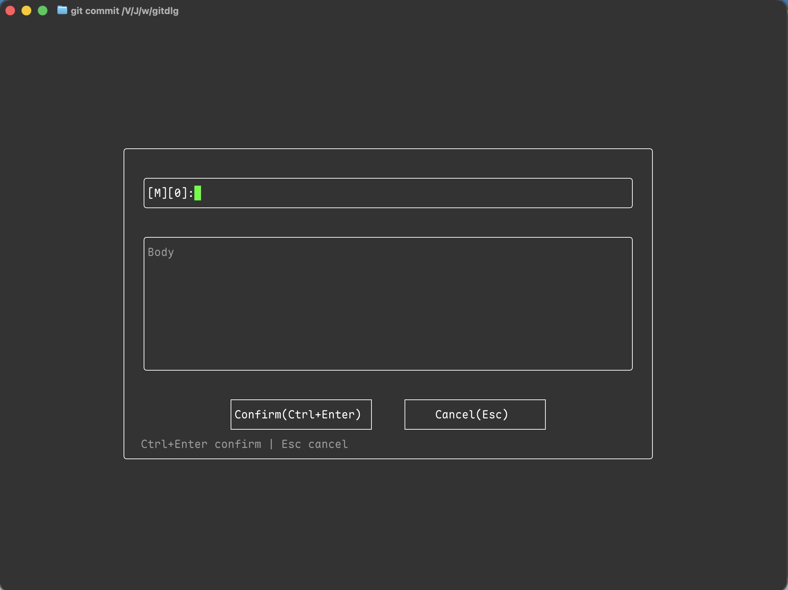

# gitdlg

**git dialog** — 面向 Git 提交信息的 TUI 对话框编辑器。

基于 Zig 0.16 与 [libvaxis](https://github.com/rockorager/libvaxis)。作为 `$GIT_EDITOR` / `core.editor` 使用时，用 Subject + Body 表单替代纯文本编辑。

[English README](README.md)

<p align="center">
  
</p>

## 功能

- 居中对话框：Subject + Body
- Tab / Shift+Tab 切换焦点（主题 → 正文 → 确认 → 取消）
- 确认 / 取消按钮及快捷键
- 解析 `COMMIT_EDITMSG` 中以 `#` 开头的注释行
- 取消时恢复 Git 打开的原始文件（类似 vim `:q!`，退出码 0）
- 配色跟随终端默认色（仅 bold / dim / reverse）
- 界面随 locale 切换：默认英文；`LANG` / `LC_*` 为 `zh*` 时显示中文
- 兼容 macOS Terminal.app 中文 Subject 显示

## 构建与安装

需要 [Zig](https://ziglang.org/) **0.16+**。

```bash
cd /path/to/gitdlg
zig build -Doptimize=ReleaseFast
mkdir -p ~/.local/bin
cp zig-out/bin/gitdlg ~/.local/bin/gitdlg
chmod 755 ~/.local/bin/gitdlg
gitdlg --help
```

### 安装 Zig 0.16（如未安装）

**macOS：** `brew install zig`

**Linux（x86_64）：**

```bash
curl -fsSL -o /tmp/zig.tar.xz \
  https://ziglang.org/download/0.16.0/zig-x86_64-linux-0.16.0.tar.xz
tar -xf /tmp/zig.tar.xz -C ~/.local/opt
export PATH="$HOME/.local/opt/zig-x86_64-linux-0.16.0:$PATH"
echo 'export PATH="$HOME/.local/opt/zig-x86_64-linux-0.16.0:$PATH"' >> ~/.bashrc
```

国内镜像见 [Zig 社区镜像列表](https://ziglang.org/download/community-mirrors.txt)。

## 配置 Git

```bash
# 长期使用
git config --global core.editor gitdlg
# 或绝对路径：
git config --global core.editor /path/to/gitdlg

# 单次
GIT_EDITOR=gitdlg git commit
```

## 快捷键

| 按键 | 作用 |
|------|------|
| Tab / Shift+Tab | 切换 主题 → 正文 → 确认 → 取消 |
| 确认/取消上 ↑↓←→ | 在按钮间移动 |
| Ctrl+S | 确认（保存） |
| 按钮上 Enter | 确认或取消 |
| Esc | 取消（恢复原始 `COMMIT_EDITMSG`） |

## 测试

```bash
zig build test
./scripts/integration-test.sh
python3 scripts/tui-smoke-test.py
python3 scripts/terminal-app-compat-test.py
```


