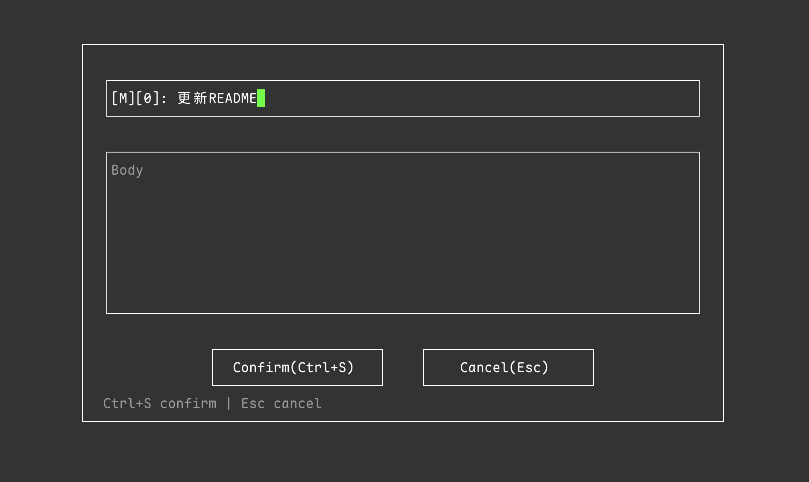

# gitdlg

**git dialog** — 面向 Git 提交信息的 TUI 对话框编辑器。

Python 3 标准库实现（`curses`，无需 pip、无需编译）。作为 `$GIT_EDITOR` / `core.editor` 使用时，用 Subject + Body 表单替代纯文本编辑。

**单文件分发**：只需拷贝 `gitdlg.py`。

[English README](README.md)

<p align="center">
  
</p>

## 功能

- 居中对话框：Subject + Body
- Tab / Shift+Tab 切换焦点（主题 → 正文 → 确认 → 取消）
- 确认 / 取消按钮及快捷键
- 解析 `COMMIT_EDITMSG` 中以 `#` 开头的注释行
- 取消时恢复 Git 打开的原始文件（类似 vim `:q!`，退出码 0）
- 配色跟随终端默认色（仅 bold / dim / reverse）
- 界面随 locale 切换：默认英文；`LANG` / `LC_*` 为 `zh*` 时显示中文
- 宽字符输入（`get_wch`），中文输入法可正常使用
- 兼容 macOS / Linux 终端：Warp、Ghostty、Terminal.app、iTerm2、Linux VT
- 支持鼠标点击，退出时会恢复终端鼠标模式，包括 Warp 的 SGR 鼠标序列

## 环境要求

- **Python 3.9+**（自带 `curses`，macOS / Linux 一般已满足）
- 交互式 TTY（在终端里执行 `git commit`）
- 中文环境建议 UTF-8 locale（`LANG=zh_CN.UTF-8` 或 `en_US.UTF-8`）

## 安装

```bash
cp gitdlg.py ~/.local/bin/gitdlg
chmod +x ~/.local/bin/gitdlg
gitdlg --help
```

或直接配置 Git（未加入 `PATH` 时推荐）：

```bash
git config --global core.editor "$(command -v python3) $HOME/.local/bin/gitdlg"
# 或绝对路径：
git config --global core.editor "/path/to/gitdlg.py"
```

## 配置 Git

```bash
# 长期使用
git config --global core.editor gitdlg

# 单次
GIT_EDITOR=gitdlg git commit
```

## 快捷键

| 按键 | 作用 |
|------|------|
| Tab / Shift+Tab | 切换 主题 → 正文 → 确认 → 取消 |
| 确认/取消上 ↑↓←→ | 在按钮间移动 |
| Ctrl+S | 确认（保存） |
| 按钮上 Enter | 确认或取消 |
| Esc | 取消（恢复原始 `COMMIT_EDITMSG`） |
| 主题框 Enter | 进入正文（无正文区时进入确认） |
| 正文框 Enter | 换行 |

## 项目结构

| 路径 | 说明 |
|------|------|
| `gitdlg.py` | **完整应用**，分发时只拷贝此文件 |
| `AGENTS.md` | Agent 开发指引（通用） |
| `skills/gitdlg/SKILL.md` | Agent 详细开发文档 |
| `scripts/test_gitdlg.py` | 单元测试 |
| `scripts/integration-test.sh` | Git + PTY 集成测试 |
| `scripts/tui-smoke-test.py` | PTY 冒烟测试 |
| `scripts/terminal-app-compat-test.py` | Terminal.app / 中文测试 |
| `scripts/warp-garbage-test.py` | Warp 鼠标 / 终端协议乱码测试 |
| `scripts/pty_harness.py` | PTY 测试辅助 |

## 测试

```bash
python3 scripts/test_gitdlg.py
chmod +x scripts/integration-test.sh
./scripts/integration-test.sh
```

## 分支

| 分支 | 实现 |
|------|------|
| `py` | Python 3 单文件（`gitdlg.py`）— **当前** |
| `main` | Zig + libvaxis 静态二进制 |

## 许可证

MIT License。Copyright (c) 2026 Jiaji Yin。详见 [LICENSE](LICENSE)。
